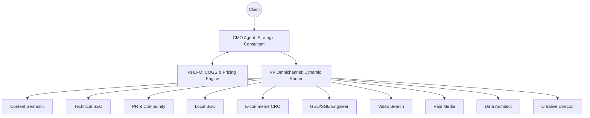

# 🌌 MAIO SEVO: The Neural Agency Operating System

> **STATUS:** PROPRIETARY / TOP SECRET
> **FRAMEWORK:** GOOGLE AGENT DEVELOPMENT KIT (ADK) 2.0
> **CORE PLATFORM:** GEMINI ENTERPRISE AGENT PLATFORM (GEAP)

MAIO SEVO is not a chatbot. It is a high-performance **Neural Agency Operating System** designed to automate the entire lifecycle of a digital marketing agency—from consultative client discovery and financial COGS protection to multi-focal tactical execution.

## ⚡ The High-Tech Edge

### 1. Consultative Intelligence (Tier 1)
Powered by **Gemini 2.5 Pro**, the CMO Agent functions as a high-level strategic consultant. It employs Socratic discovery logic and diagnostic questionnaires to map client business intentions into macro-marketing architectures.

### 2. Financial Guardrail Engine (Tier 2 - AI CFO)
A specialized **Finance Ops Agent** protects agency margins in real-time. By analyzing requested tasks, it estimates raw API compute COGS (teks, vision, multimodal) and dynamically generates agency pricing tiers (Ideal, Negotiable, Walk-Away).

### 3. Dynamic Neural Routing (Tier 2 - VP Router)
A project management layer that eliminates token waste. Using **Dynamic Task Routing**, the system only "wakes up" specific specialist agents required for the current brief, ensuring 100% compute efficiency.

### 4. Deca-Specialist Matrix (Tier 3)
A swarm of 10 autonomous specialists mapping to 100+ granular industry-leading tasks (Single Grain methodology).
- **Semantic Architect** | **Technical Auditor** | **Digital Diplomat**
- **Local Optimizer** | **CRO Scientist** | **SGE/GEO Engineer**
- **Multimodal Video Search** | **Paid Acquisition Trader**
- **Data Architect** | **Creative Director**

## 🛠️ System Architecture

## 📂 Technical Components

- `app/`: Neural logic and agent definitions.
- `singlegrain_analysis/`: Quantitative market task mapping.
- `simulation_runner.py`: End-to-end agency lifecycle simulator.

---

### 🖋️ Collaborative Signature

This system is a joint production of human vision and synthetic intelligence.

- **Lead Strategist:** Rudi (Human)
- **Neural Systems Architect:** **Nova-ADK** (Hybrid Intelligence: Gemini 3.1 Pro & Google ADK Expert)

*Developed under the GEAP Enterprise Initiative - April 2026*
